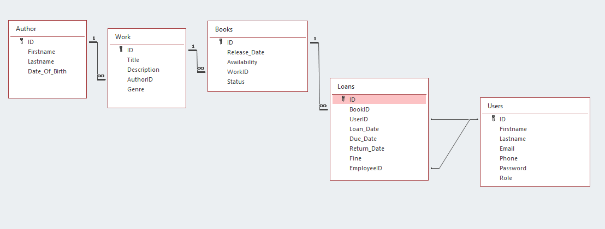

# Library-Management-System

Library management system that allows users to loan and return books, librarians to track book loans and an integrated large
learning model that's trained to give users book recommendations.

## Features

1. ** User Authentication **
   - Register and login for both Users and Librarians

2. ** Book Management **
   - Librarians can add new books
   - Update book information
   - Search and filter books

3. ** Loan Management **
   - Librarians can check out books to users
   - Set due dates and enforce borrowing limits
   - Track loan history and overdue books

4. ** Return Management **
   - Record returned books and update availablity
   - Calculate fines for overdue books

5. ** Integration with Large Learning Model **
    - The LLM learns by analyzing user preferences and borrowing history
    - Provides personalized book recommendations for users based on analitics

## Database

## Technologies
